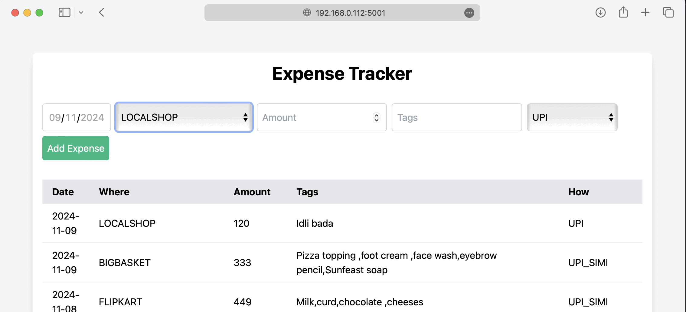

# flask-expense-app

[](https://pypi.org/project/flask-expense-app/)
[](https://github.com/sukhbinder/flask-expense-app/releases)
[](https://github.com/sukhbinder/flask-expense-app/actions/workflows/test.yml)
[](https://github.com/sukhbinder/flask-expense-app/blob/master/LICENSE)

Flask expense app 

## Installation

Install this tool using `pip`:
```bash
pip install flask-expense-app
```
## Usage

For help, run:
```bash
flask-expense-app --help
```

You can also use:
```bash
python -m flask_expense_app --help
```

Expense data looks like this:

```csv

DATE,WHERE,AMOUNT,TAGS,HOW
2024-11-08,FLIPKART,449,"Milk,curd,chocolate ,cheeses",UPI_SIMI
2024-11-08,RELIANCEFRESH,199,"Paneer,milk,curd,pizza base",UPI_SIMI
2024-11-08,LOCAL SHOP,55,"Guava,coriander leaves",UPI_SIMI
2024-11-08,LOCALSHOP,246,Onion tomato okra beans brinjal karela ,UPI
2024-11-08,LOCALSHOP,100,4kg onions,UPI
2024-11-07,Peperfry,349,Bedsheet,UPI_SIMI
2024-11-07,LOCALSHOP,50,Xerox and pens,UPI
```



## Development

To contribute to this tool, first checkout the code. Then create a new virtual environment:
```bash
cd flask-expense-app
python -m venv venv
source venv/bin/activate
```
Now install the dependencies and test dependencies:
```bash
pip install -e '.[test]'
```
To run the tests:
```bash
python -m pytest
```
